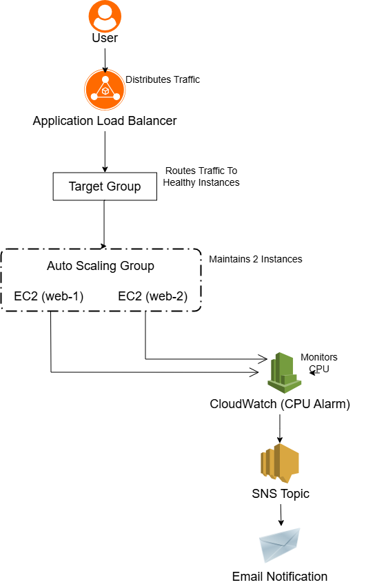
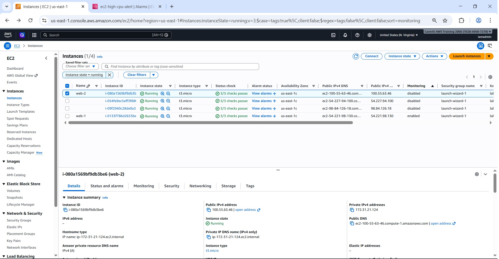
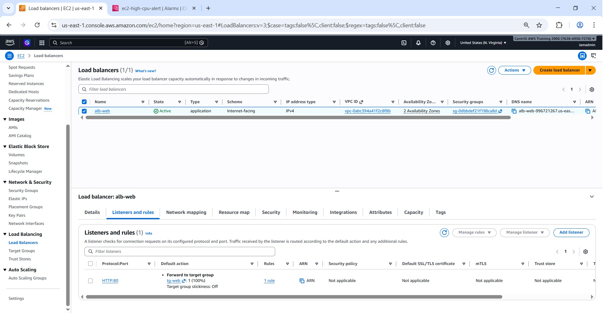
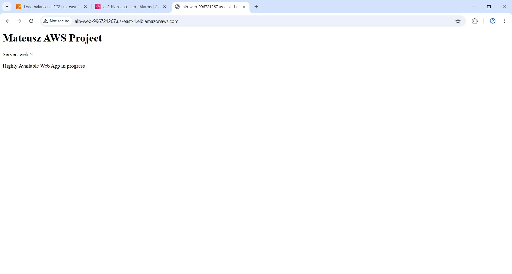
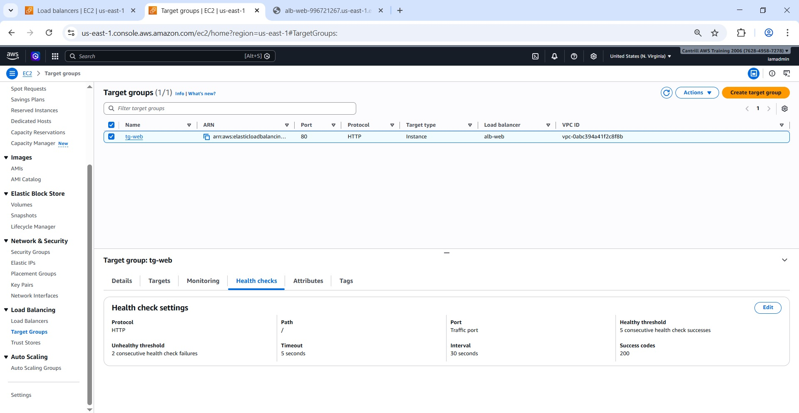
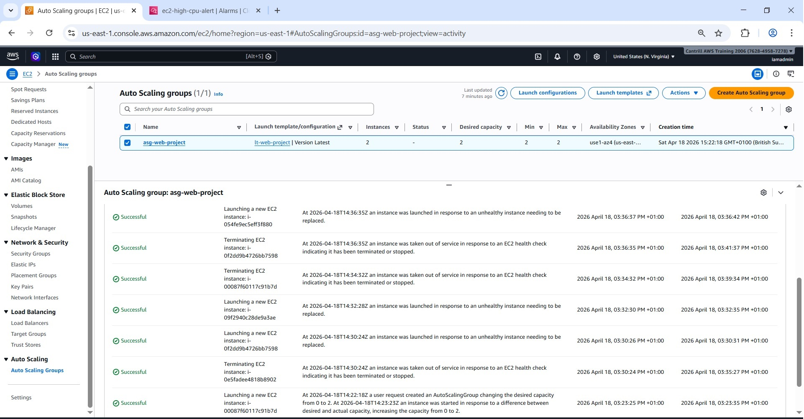
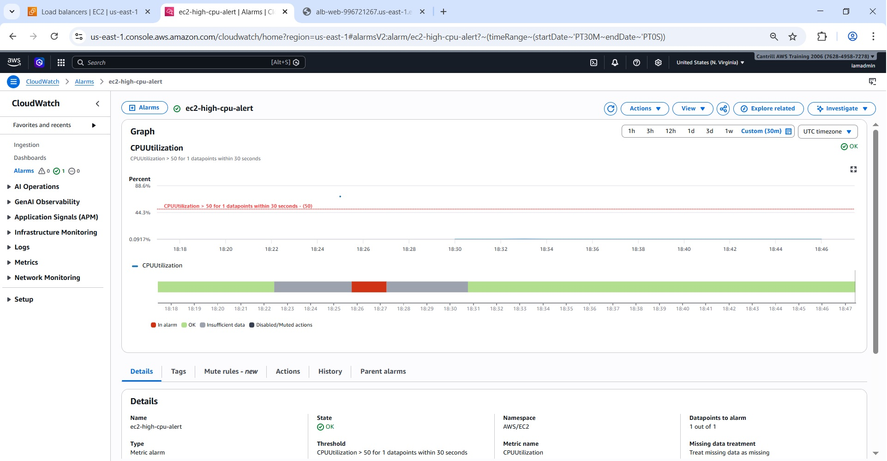
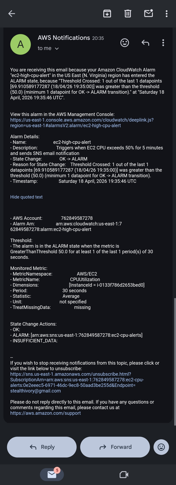

# AWS Highly Available Web Application

This project simulates a production-like highly available web application environment on AWS.

Live Demo: http://alb-web-996721267.us-east-1.elb.amazonaws.com/

The setup ensures high availability by distributing traffic across multiple EC2 instances and automatically replacing unhealthy instances.

---

## Project Context

This project was built as part of my transition into cloud computing, with the goal of simulating a real production environment.

The focus was on designing a system that is highly available, observable, and capable of handling failures.

---

## Real-World Use Case

This type of architecture is commonly used for production web applications where high availability and minimal downtime are critical.

For example, e-commerce platforms, SaaS applications, or internal company tools rely on similar setups to ensure services remain accessible even during instance failures or traffic spikes.

This project simulates how such systems are designed, monitored, and troubleshooted in real environments.

---

## Project Scenario

The environment simulates a real-world web application that must remain available even when individual components fail or configurations are incorrect.

Failures such as misconfigured security groups, incorrect health checks, and routing issues were intentionally tested to understand system behaviour and improve troubleshooting skills.

---

## Architecture

This project simulates a production-like cloud architecture focusing on:

- High availability
- Fault tolerance
- Auto-healing infrastructure
- Monitoring and alerting
- Troubleshooting cloud infrastructure issues

Designed as a Cloud Support / Cloud Operations practice environment.

---

## Architecture Overview

The application is deployed across multiple Availability Zones to ensure high availability.

Traffic is distributed by an Application Load Balancer to EC2 instances managed by an Auto Scaling Group.

Health checks ensure only healthy instances receive traffic, while CloudWatch monitors performance and triggers alerts via SNS when thresholds are exceeded.

---

## Technologies Used

- Amazon EC2  
- Amazon VPC  
- Application Load Balancer (ALB)  
- Auto Scaling Group (ASG)  
- Target Groups  
- CloudWatch  
- SNS  
- Launch Template  
- Security Groups  
- HTML  

---

## Troubleshooting Experience

During this project, I intentionally introduced and resolved common infrastructure issues to simulate real-world support scenarios.

- **Security Groups:** Diagnosed and fixed misconfigured rules that prevented EC2 instances from registering with target groups  
- **Health Checks:** Resolved failures caused by incorrect application endpoint paths  
- **Load Balancer:** Diagnosed routing issues and verified listener and target group configuration  
- **Monitoring:** Simulated high CPU usage and validated CloudWatch alarms and SNS notifications  

These scenarios helped me develop practical troubleshooting skills in AWS environments.

---

## Troubleshooting Approach

When issues occurred, I followed a structured troubleshooting approach:

1. Checked target group health status  
2. Verified EC2 instance state  
3. Confirmed the web application was running on the instance  
4. Reviewed security group inbound rules  
5. Checked load balancer listener and target group configuration  
6. Validated CloudWatch alarms and SNS notifications  

This helped identify root causes and understand how different AWS components interact.

---

## Application

The application is a simple web page deployed on EC2 instances.

It displays:

- Server name (web-1 / web-2)  
- Basic project information  

The load balancer distributes traffic between instances.

This simple application is used to demonstrate load balancing, scaling, failover behaviour, and monitoring.

---

## EC2 Instances

EC2 instances host the web application and are managed by Auto Scaling.

---

## Load Balancer

Application Load Balancer distributes incoming traffic across multiple EC2 instances.

---

## Load Balancing

Traffic is routed between different instances.

---

## Target Group Health Checks

Target groups ensure only healthy instances receive traffic.

---

## Auto Scaling

Auto Scaling automatically replaces unhealthy instances and maintains the desired number of instances across multiple Availability Zones.

---

## CloudWatch Alarm

CloudWatch monitors CPU usage and triggers an alarm when the threshold is exceeded.

---

## SNS Notification

When the alarm is triggered, an email notification is sent using SNS.

---

## Key Features

- High availability across multiple Availability Zones  
- Automatic scaling and self-healing infrastructure  
- Load balancing across instances  
- Health checks and failover  
- Monitoring and alerting  
- Fault tolerance  
- Practical troubleshooting scenarios  

---

## Deployment Overview

The infrastructure was built using EC2, Application Load Balancer, Auto Scaling Group, CloudWatch, and SNS.

The deployment included:

1. Creating a Launch Template with User Data to install and configure the web server automatically  
2. Launching EC2 instances using the Launch Template  
3. Deploying a simple HTML application  
4. Creating a Target Group  
5. Registering EC2 instances in the Target Group  
6. Creating an Application Load Balancer  
7. Configuring listener rules  
8. Creating an Auto Scaling Group across multiple Availability Zones  
9. Attaching the Target Group to the Auto Scaling Group  
10. Configuring a CloudWatch alarm  
11. Creating an SNS topic and email subscription  

The application is accessible via the Load Balancer DNS.

---

## Security Considerations

- Security Groups restrict access between the Load Balancer and EC2 instances  
- EC2 instances should use IAM roles with least privilege  
- In production, HTTPS using ACM should be implemented  
- AWS WAF could be added for additional protection  

---

## What I Learned

- How to design a highly available AWS architecture  
- How Application Load Balancer distributes traffic across healthy targets  
- How Auto Scaling helps replace unhealthy instances  
- How health checks affect target group registration  
- How security group misconfigurations can block traffic  
- How CloudWatch and SNS support monitoring and alerting  
- How to perform root-cause analysis (RCA) for infrastructure issues  
- How systems behave under failure conditions  

---

## Future Improvements

- Add HTTPS using AWS Certificate Manager (ACM)  
- Add CloudWatch Logs  
- Add CI/CD pipeline using GitHub Actions  
- Rebuild the infrastructure using Terraform or CloudFormation in a future version  

---

## Author

Mateusz Synowiec
